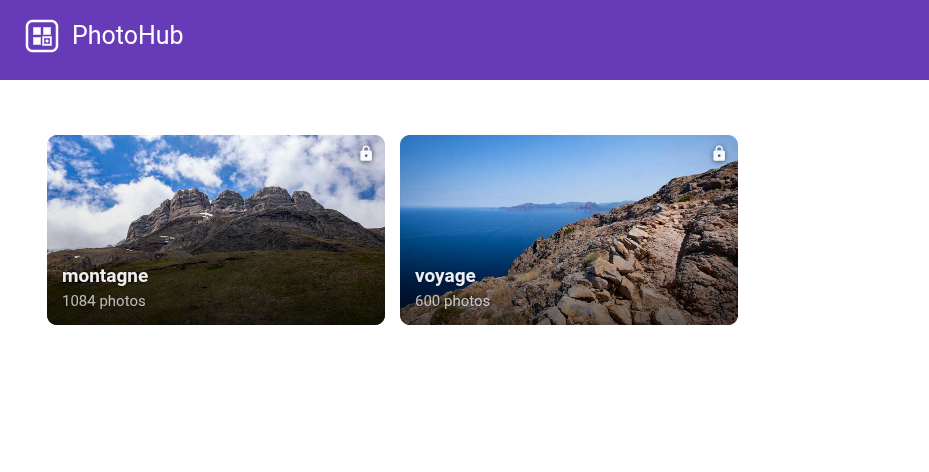

# PhotoHub

A self-hosted photo gallery — upload, tag, organize and share your photos.

- Photo and video uploads
- Tag and tag group organization
- Favorites and 0–5 star ratings
- Dynamic views: saved filters with sorting and custom ordering
- Sharing: public views, share links, unique upload links
- GPS map for geolocated photos




# Install

```bash
docker compose up
```

The stack runs as three services from a single image (`shaftmx/photohub`):

- **db** — MySQL 8 database
- **web** — Django + nginx, serves the app and API
- **worker** — runs the video transcoding loop, starts only after `web` is healthy

> The goal is one image covering both `web` and `worker` modes — deployable anywhere with a simple compose file.

## Configuration

Edit the `environment` section of `docker-compose.yml` before starting:

| Variable | Default | Description |
|---|---|---|
| `DJANGO_URL` | — | Public URL of the app (e.g. `https://mysite.fr`). Used for CSRF validation. |
| `DJANGO_SECRET_KEY` | insecure default | Django secret key — **change in production**. |
| `DJANGO_SUPERUSER_USERNAME` | `admin` | Initial admin username. |
| `DJANGO_SUPERUSER_PASSWORD` | `admin` | Initial admin password — **change in production**. |
| `HEADER_ALLOW_ORIGIN` | — | Value for `Access-Control-Allow-Origin`. |
| `DB_NAME` / `DB_USER` / `DB_PASSWORD` / `DB_HOST` | — | Database connection. |
| `MYSQL_ROOT_PASSWORD` | `changeme` | MySQL root password — **change in production**. |
| `NGINX_MAX_UPLOAD_SIZE` | `10240m` | Max upload size enforced by nginx. |
| `LOG_LEVEL` | `WARNING` | Django log level (`DEBUG`, `INFO`, `WARNING`, `ERROR`). |

> Photo quality, video, and gallery settings can be changed live from the Admin panel without restarting.

## Persistent data

Uncomment the `volumes` lines in `docker-compose.yml` to persist data between restarts:

```yaml
# db service — MySQL data
volumes:
  - "/your/path/db:/var/lib/mysql"

# web / worker service — media files
# Contains: raw originals (/data/static/raw/) and generated thumbnails (/data/static/cache/samples/)
volumes:
  - "/your/path/photos:/data"

# web service — export/import dumps (Admin → Backup)
volumes:
  - "/your/path/dumps:/dumps"
```

## Quick start

**1. Start the stack**

```bash
docker compose up
```

Open http://localhost:8080 — log in with the credentials set in `DJANGO_SUPERUSER_USERNAME` / `DJANGO_SUPERUSER_PASSWORD` (default: `admin` / `admin`).

**2. Load sample tags**

Go to **Admin → Tags**. If no tags exist yet, a **"Load sample"** button appears — click it to prefill a starter tag structure. Adjust it to your needs and save.

**3. Upload photos**

Go to **Upload**, drag and drop your photos. Review **Admin → Photo quality** to adjust compression and thumbnail settings if needed.


# Troubleshooting

## Login failure — `SyntaxError: Unexpected token '<', "<!DOCTYPE"... is not valid JSON`

CSRF token mismatch. The `DJANGO_URL` environment variable is pointing to the wrong URL — the CSRF token returned by the API doesn't match the one sent by the frontend. Check the `DJANGO_URL` value in your docker-compose environment.


# Architecture

```
   Browser
      |
      v
+------------------------------------------+
|  web                                     |
|  nginx — serves frontend (Vue, built at  |
|           image build time) + media files|
|  Django — API :5000                      |
+------------------------------------------+
          |                  |
          v                  v
    +----------+    +----------------------+
    |  db      |    |  worker  (optional)  |
    |  MySQL 8 |    |  video transcoding   |
    +----------+    +----------------------+
```

See [dev.md](dev.md) for the full dev stack architecture and implementation notes.

# Dev

```bash
docker compose -f docker-compose.yml -f docker-compose-dev.yml up --build
```

Opens at http://localhost:8080. Vue is served by Vite with HMR, Django reloads automatically on code changes.

See [dev.md](dev.md) for the full dev stack details, migrations, database, and upgrade procedures.

# Alternatives

Other self-hosted photo library projects considered during development:

- https://github.com/LycheeOrg/Lychee
- https://fr.piwigo.org/
- https://github.com/immich-app/immich
- https://meichthys.github.io/foss_photo_libraries/
- https://github.com/LibrePhotos/librephotos
- https://github.com/photoprism/photoprism
- https://tropy.org/
- https://github.com/ente-io/ente
- https://github.com/nextcloud/photos

