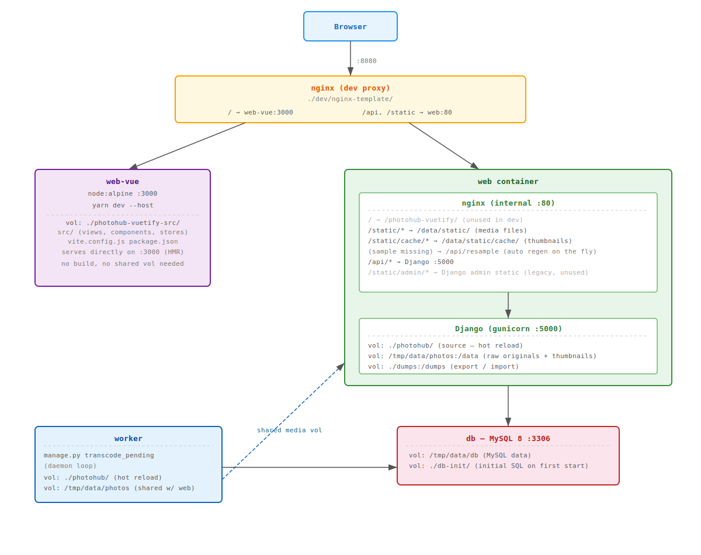

# PhotoHub — Dev notes

Implementation notes and references collected during development.

---

## Architecture — dev stack



### Dev vs prod — différences clés

Les volumes, chemins et services sont **identiques en dev et en prod**, à une exception près : la façon dont le frontend Vue est servi.

| | Dev | Prod |
|---|---|---|
| Frontend (`/`) | Servi par `web-vue` (Vite HMR, `:3000`) via le nginx dev proxy | Servi par le nginx interne de `web` depuis `/photohub-vuetify/` (baked dans l'image) |
| `/api`, `/static` | Servi par `web` (Django + nginx) | Idem |
| Build Vue | Pas de build — Vite sert depuis les sources | `yarn build` au moment du `docker build` (multi-stage) |
| node container | `web-vue` tourne en permanence | Absent — node n'est plus nécessaire au runtime |

### Frontend build en production

Le Dockerfile utilise un **multi-stage build** :

1. **Stage `build`** (node:alpine) — copie `photohub-vuetify-src/`, installe les dépendances et lance `yarn build`. Le JS/CSS compilé est écrit dans `/photohub-vuetify/`.
2. **Stage final** (python) — copie le résultat avec `COPY --from=build /photohub-vuetify /photohub-vuetify`. Le frontend est **baked dans l'image**, sans dépendance node au runtime.

Le volume `/tmp/photohub-vuetify:/photohub-vuetify` existait pour overrider ce contenu baked sans reconstruire l'image. Depuis l'introduction de `web-vue` avec HMR, il n'est plus nécessaire en dev et est commenté dans `docker-compose-dev.yml`.

---

## Vue / Vuetify

### Navigation

```js
// Navigate by path
router.push({ path: 'home' })

// Navigate by name
router.push({ name: 'user', params: { userId: '123' } })

// Reload current page
this.$router.go()
```

### Component communication

- **Emit events**: [learnvue.co](https://learnvue.co/articles/vue-emit-guide) — [vuejs.org](https://vuejs.org/guide/components/events.html#emitting-and-listening-to-events)
- **Global properties**: [blog.logrocket.com](https://blog.logrocket.com/vue-js-globalproperties/)
- **Force re-render**: [michaelnthiessen.com](https://michaelnthiessen.com/force-re-render)
- **Call method from outside component**: [dev.to](https://dev.to/jannickholmdk/vue-js-how-to-call-a-method-in-a-component-from-outside-the-component-3c81)
- **Event bus (Vue 3)**: [blog.logrocket.com](https://blog.logrocket.com/using-event-bus-vue-js-pass-data-between-components/)

### Responsive images

Serve different image sizes based on resolution using the `<picture>` element:
[MDN — `<picture>`](https://developer.mozilla.org/fr/docs/Web/HTML/Element/picture)

### Script style

```
<script>        → Options API
<script setup>  → Composition API
```
Vuetify docs use Options API — most of the codebase follows that convention.

### Frontend structure

```
router/       — the app revolves around this. Loads pages via <router-view /> which acts as a
                placeholder for the "component" content defined in each route.
App.vue       — main entry point
assets/       — static files
layouts/      — page layouts: placement of AppBar, sidebar, <v-main> content area.
                See https://vuetifyjs.com/en/features/application-layout/#placing-components
components/   — reusable small components (forms, buttons, etc.) used across multiple views
views/        — full page content; each view can call components
main.js       — app definition
plugins/      — Vuetify, Pinia, router, etc.
```

### Theme / colors

Custom colors: `src/plugins/vuetify.js` — [Vuetify color docs](https://vuetifyjs.com/en/styles/colors/)

---

## Gallery CSS inspiration

- https://codemyui.com/grid-style-photo-gallery/
- https://codepen.io/ettrics/pen/VvxmPV
- https://codepen.io/DarkoKukovec/pen/mgowGG
- https://codepen.io/johandegrieck/pen/xpVdBG

---

## Ajouter une dépendance npm

Avec le dev stack en cours (`web-vue` container actif), exec directement dedans. Le source est monté en volume donc `package.json` et `yarn.lock` sont mis à jour sur le host automatiquement.

```bash
docker compose -f docker-compose.yml -f docker-compose-dev.yml exec web-vue yarn --cwd /photohub-vuetify-src add <package>
```

Committer `package.json` et `yarn.lock` après l'ajout.

---

## Customizing the sample tags

When the Admin → Tags tab is empty, a **"Load sample"** button appears. It prefills the YAML editor with a built-in sample tag structure.

To change the sample, edit:

```
photohub-vuetify-src/src/data/tags_sample.yml
```

The file is bundled into the frontend at build time (`import ... ?raw` via Vite) — no backend change needed, just edit the YAML and rebuild the frontend.

---

## Upgrading dependencies

### Django

Reference: https://docs.djangoproject.com/fr/5.1/howto/upgrade-version/

Django and all Python dependencies are pinned in `photohub/requirements.txt`. To upgrade:

```bash
# 1. Build the current image so we have a base to upgrade from
docker compose -f docker-compose.yml -f docker-compose-dev.yml build

# 2. Start a temporary container and open a shell
docker run --rm -it shaftmx/photohub bash

# Inside the container:
# 3. Upgrade all packages (Django and every other lib in requirements.txt)
pip3 install --upgrade -r /photohub/requirements.txt

# 4. Write the new pinned versions to stdout — copy this output
pip3 freeze

exit
```

```bash
# 5. Back on the host: paste the pip3 freeze output into requirements.txt
vim photohub/requirements.txt

# 6. Rebuild from scratch to validate the new pins install cleanly
docker compose -f docker-compose.yml -f docker-compose-dev.yml build --no-cache
```

Steps 1–4 run inside an ephemeral container that is discarded — `pip install` there does not persist.
The only persistent change is step 5: replacing `requirements.txt` on the host with the new frozen versions.
Step 6 rebuilds from scratch to confirm the new pins resolve cleanly.

### Node / Vue / Vuetify

Node version is set in the Dockerfile (`FROM node:lts-alpine...`). Package versions are in `photohub-vuetify-src/package.json` and `yarn.lock`.

To upgrade Node itself, update the tag in both places:

```dockerfile
# Dockerfile — update the node build stage
FROM node:lts-alpine3.21 AS build   # ← change the tag here
```

```yaml
# docker-compose-dev.yml — update the web-vue service
web-vue:
  image: node:lts-alpine3.21        # ← change to the same tag
```

Then upgrade the JS packages using the dev container (no rebuild needed — the source is mounted as a volume):

```bash
# 1. Open a shell in the node container (dev stack must be running)
docker compose -f docker-compose.yml -f docker-compose-dev.yml exec web-vue sh

# Inside the container (source is mounted at /photohub-vuetify-src):
cd /photohub-vuetify-src

# 2. Upgrade all packages to latest allowed by semver ranges
yarn upgrade

# 3. Optionally: upgrade past semver ranges (check changelogs for breaking changes first)
yarn upgrade --latest

exit
```

```bash
# 4. Back on the host: yarn.lock and package.json are updated automatically
#    (the source directory is mounted as a volume — changes are already on disk)

# 5. Rebuild the image with the new Node version and new packages to validate
docker compose -f docker-compose.yml -f docker-compose-dev.yml build --no-cache
```

To upgrade Vuetify specifically, follow https://vuetifyjs.com/en/getting-started/upgrade-guide/ before running `yarn upgrade --latest`.

---

## Initialisation du projet (historique)

Comment le projet a été bootstrappé initialement.

### Backend Django

```bash
docker run -it -v $PWD:/opt/ python:3 bash
pip install --upgrade pip
pip3 install django
pip freeze > requirements.txt
cd /opt
django-admin startproject photohub
cd photohub/
python manage.py startapp hub
```

### Frontend Vue / Vuetify

```bash
# https://vuetifyjs.com/en/getting-started/installation/#using-vite
docker run -it -v $PWD/photohub-vuetify-src/:/photohub-vuetify-src node:lts-alpine3.21 sh
cd /tmp
apk add rsync
yarn create vuetify
# > project name: photohub-vuetify
# > preset: base
# > typescript: no
# > dependencies: yarn
yarn add pinia
rsync -av /tmp/photohub-vuetify/ /photohub-vuetify-src/
```

---

## Initialiser la DB depuis un dump (db-init)

Le dossier `db-init/` est monté dans le container `db` via `docker-compose-dev.yml`. MySQL l'utilise pour exécuter automatiquement tous les fichiers `.sql` qu'il contient **au premier démarrage** (si la DB est vide).

```bash
# Dumper la DB courante dans db-init/
docker compose -f docker-compose.yml -f docker-compose-dev.yml exec db \
  bash -c 'mysqldump -uroot -p$MYSQL_ROOT_PASSWORD photohub' > db-init/photohub.sql

# Pour que MySQL le rejoue au prochain démarrage, supprimer le volume DB d'abord
rm -rf /tmp/data/db
docker compose -f docker-compose.yml -f docker-compose-dev.yml up db
```

Utile pour partager un jeu de données de dev ou bootstrapper un nouvel environnement.

---

## Se connecter à la base de données

```bash
# Via Django dbshell (depuis le container web)
docker compose -f docker-compose.yml -f docker-compose-dev.yml exec web python /photohub/manage.py dbshell

# Directement via MySQL dans le container db
docker compose -f docker-compose.yml -f docker-compose-dev.yml exec db mysql -uphotohub -psecret photohub
```

## Migrations Django

```bash
# Create new migrations after modifying a model
docker compose -f docker-compose.yml -f docker-compose-dev.yml exec web python /photohub/manage.py makemigrations

# Squash / update an existing migration file in place (keeps migration count clean)
docker compose -f docker-compose.yml -f docker-compose-dev.yml exec web python /photohub/manage.py makemigrations --update

# Apply pending migrations
docker compose -f docker-compose.yml -f docker-compose-dev.yml exec web python /photohub/manage.py migrate

# Inspect the current DB schema as Django model code
docker compose -f docker-compose.yml -f docker-compose-dev.yml exec web python /photohub/manage.py inspectdb
```

**Squashing all migrations into one (dev only — not yet released):**

Since the app has no public release, the migration history can be reset at any time:

```bash
# Delete all migration files (keep __init__.py)
rm photohub/hub/migrations/0*.py

# Recreate a single initial migration from the current models
docker compose -f docker-compose.yml -f docker-compose-dev.yml exec web python /photohub/manage.py makemigrations

# Apply it (drop + recreate the DB first if needed — see below)
docker compose -f docker-compose.yml -f docker-compose-dev.yml exec web python /photohub/manage.py migrate
```

## Reset the database (dev only)

```bash
# Option 1 — flush all data while keeping the schema
docker compose -f docker-compose.yml -f docker-compose-dev.yml exec web python /photohub/manage.py flush

# Option 2 — drop and recreate the database (useful after squashing migrations)
docker compose -f docker-compose.yml -f docker-compose-dev.yml exec db bash -c \
  'mysql -uroot -p$MYSQL_ROOT_PASSWORD -e "drop database photohub; create database photohub;"'

# Then re-run migrations to recreate the schema
docker compose -f docker-compose.yml -f docker-compose-dev.yml exec web python /photohub/manage.py migrate
```
